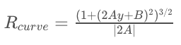

## Writeup Template

### You can use this file as a template for your writeup if you want to submit it as a markdown file, but feel free to use some other method and submit a pdf if you prefer.

---

**Advanced Lane Finding Project**

The goals / steps of this project are the following:

* Compute the camera calibration matrix and distortion coefficients given a set of chessboard images.
* Apply a distortion correction to raw images.
* Use color transforms, gradients, etc., to create a thresholded binary image.
* Apply a perspective transform to rectify binary image ("birds-eye view").
* Detect lane pixels and fit to find the lane boundary.
* Determine the curvature of the lane and vehicle position with respect to center.
* Warp the detected lane boundaries back onto the original image.
* Output visual display of the lane boundaries and numerical estimation of lane curvature and vehicle position.

[//]: # (Image References)

[image1]: ./writeup_images/camera-calibration.png "Undistorted"
[image2]: ./test_images/test9.jpg "Road Transformed"
[image3]: ./writeup_images/thresholding.png "Binary Example"
[image4]: ./writeup_images/perspective.png "Warp Example"
[image5]: ./writeup_images/lane-lines.png "Fit Visual"
[image6]: ./writeup_images/output.png "Output"
[video1]: ./project_video.mp4 "Video"

## [Rubric](https://review.udacity.com/#!/rubrics/571/view) Points

### Here I will consider the rubric points individually and describe how I addressed each point in my implementation.  

---

### Writeup / README

#### 1. Provide a Writeup / README that includes all the rubric points and how you addressed each one.  You can submit your writeup as markdown or pdf.  [Here](https://github.com/udacity/CarND-Advanced-Lane-Lines/blob/master/writeup_template.md) is a template writeup for this project you can use as a guide and a starting point.  

You're reading it!

### Camera Calibration

#### 1. Briefly state how you computed the camera matrix and distortion coefficients. Provide an example of a distortion corrected calibration image.

The code for this step is contained in Section 1 of the IPython notebook located in "./advanced-lane-finding.ipynb" (cell 1-4).  

I start by preparing "object points", which will be the (x, y, z) coordinates of the chessboard corners in the world. Here I am assuming the chessboard is fixed on the (x, y) plane at z=0, such that the object points are the same for each calibration image.  Thus, `objp` is just a replicated array of coordinates, and `objpoints` will be appended with a copy of it every time I successfully detect all chessboard corners in a test image.  `imgpoints` will be appended with the (x, y) pixel position of each of the corners in the image plane with each successful chessboard detection.  

I then used the output `objpoints` and `imgpoints` to compute the camera calibration and distortion coefficients using the `cv2.calibrateCamera()` function.  I applied this distortion correction to the test image using the `cv2.undistort()` function and obtained this result: 

![alt text][image1]

### Pipeline (single images)

#### 1. Provide an example of a distortion-corrected image.

To demonstrate this step, I will describe how I apply the distortion correction to one of the test images like this one:
![alt text][image2]

#### 2. Describe how (and identify where in your code) you used color transforms, gradients or other methods to create a thresholded binary image.  Provide an example of a binary image result.

I used a combination of color, hsv and gradient thresholds to generate a binary image (thresholding steps at Section 3 of the notebook).  Here's an example of my output for this step.

I used HSV instead of HLS as suggested by mentors in the forum. It seems to perform marginally better than HLS.

![alt text][image3]

As you can see, the Sobel threshhold works pretty well for most cases except for bright images as shown below. For which the S channel threshold works better.


#### 3. Describe how (and identify where in your code) you performed a perspective transform and provide an example of a transformed image.

As alredy done in the camera clibration step. I used `cv2.getPerspectiveTransform()` to get the perspective transformation matrix. Then use `cv2.warpPerspective` to transform the 3d view of the road to a bird-eye top down view.

The code for my perspective transform is at section 4 of the notebook file.  The `perspectiveTransform()` function takes as inputs an image (`img`). The source and destination poitns are hard coded as the following:

``` 
    src = np.float32([[200, 720], [550, 480], [730, 480], [1080, 720]])
    dst = np.float32([[200, 720], [200,0], [1080,0], [1080, 720]])

```

I verified that my perspective transform was working as expected by drawing the `src` and `dst` points onto a test image and its warped counterpart to verify that the lines appear parallel in the warped image.

![alt text][image4]

#### 4. Describe how (and identify where in your code) you identified lane-line pixels and fit their positions with a polynomial?

To identify the lane lines from scratch, I used the sliding window technique described in the course material. First I create a histogram of all columns in the lower half of the binary warped image. Then identify the two peaks in the histogram. Then we slice the images into 9 sections, use the two peaks identified early as the base line to search for the lane line in each section. Once we find all the pixels representing the lane lines, we do a second order polynomial fit as the detected lane lines.

The code to find the lane lines is in section 4 of the notebook. Here's a sample result image:

![alt text][image5]

#### 5. Describe how (and identify where in your code) you calculated the radius of curvature of the lane and the position of the vehicle with respect to center.

The code to calculate the curvature is in section 5 of the notebook. Once we obtained the second order polynomial fit of the lane lines, represented as:

`f(y)=Ay^2​​+By+C`

Then the curvature of the lane line can be calculated as:




#### 6. Provide an example image of your result plotted back down onto the road such that the lane area is identified clearly.

This is implemented in `draw_lane_region()` function in section 5.  Here is an example of my result on a test image:

![alt text][image6]

---

### Pipeline (video)

#### 1. Provide a link to your final video output.  Your pipeline should perform reasonably well on the entire project video (wobbly lines are ok but no catastrophic failures that would cause the car to drive off the road!).

Here's a [link to my video result](./output_videos/project_video.mp4)
[](https://www.youtube.com/watch?v=LuIEBhCekxk)
---

### Discussion

#### 1. Briefly discuss any problems / issues you faced in your implementation of this project.  Where will your pipeline likely fail?  What could you do to make it more robust?

Here I'll talk about the approach I took, what techniques I used, what worked and why, where the pipeline might fail and how I might improve it if I were going to pursue this project further.  
